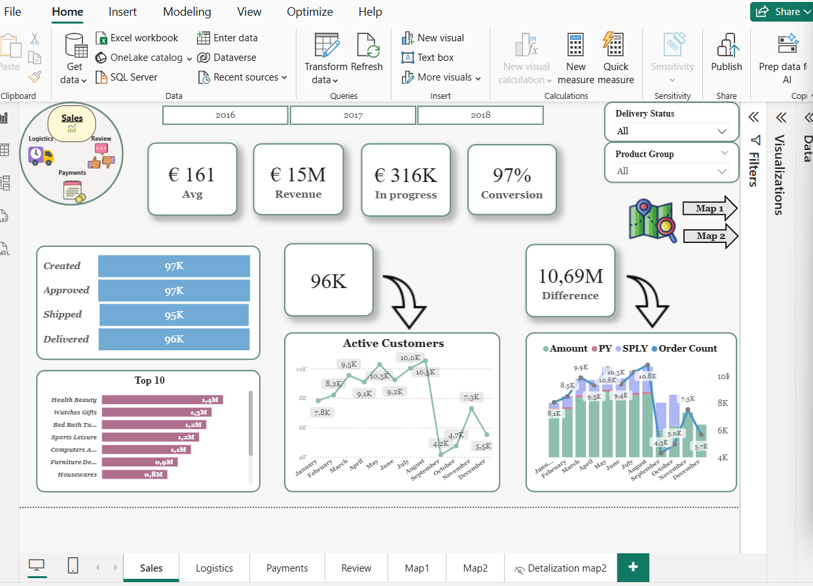
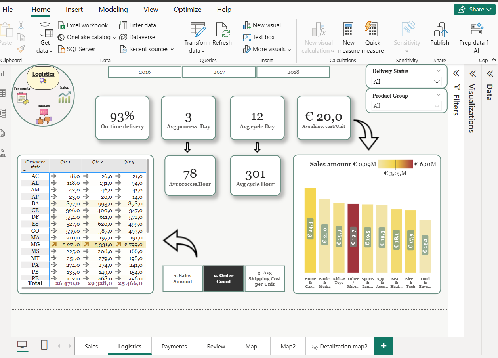
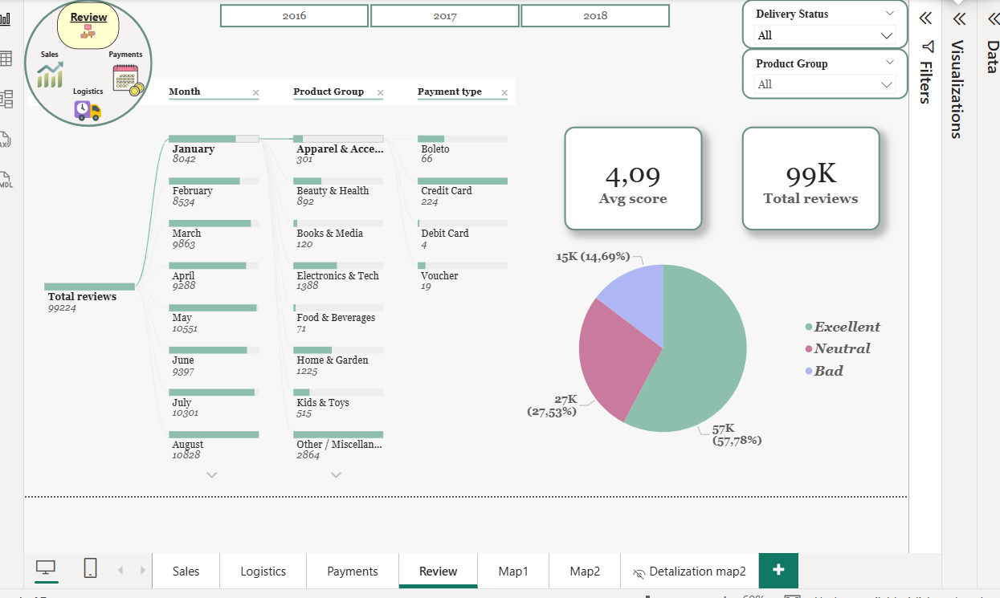
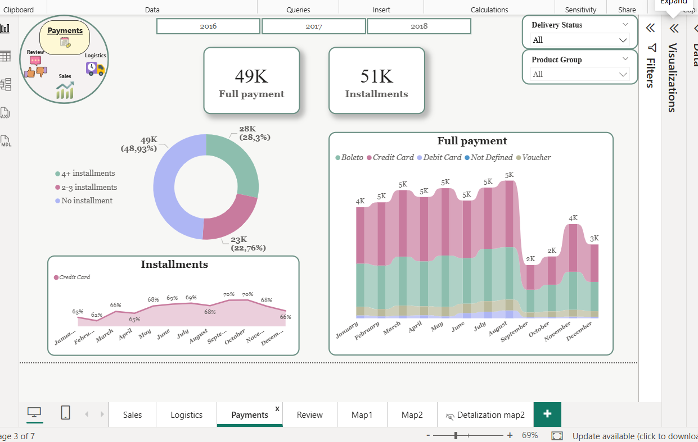

# 📊 Power BI Dashboard: E-Commerce Sales and Logistics Deep Dive

## Project Goal
This project was executed as a contracted Data Analyst assignment to design and implement a comprehensive **Power BI dashboard** analyzing key performance indicators (KPIs) across a large e-commerce platform's **Sales and Logistics** operations over 15 months. The primary objective was to provide executive-level insights and detailed interactive views for strategic decision-making.

## 🛠️ Key Skills & Technologies Demonstrated

This project showcases a broad range of Power BI and data analysis expertise:

* **Data Modeling & Transformation:** Establishing complex table relationships, managing data cardinality, and utilizing **Power Query (ETL)** to denormalize the **Orders** table for funnels and creating computed columns for product categorization.
* **DAX Proficiency:** Implementing complex measures, including **scalar and iterative DAX expressions**, for custom metric calculation (e.g., Year-over-Year comparison, Content Switching logic).
* **UX/UI and Design:** Prototyping and designing an intuitive interface across four distinct tabs (Sales, Logistics, Payments, Reviews), employing a consistent theme, color palette, and logical block structuring.
* **Advanced Functionality:** Implementing dynamic features such as buttons, bookmarks, pop-up information blocks, drill-through pages, and content switching using DAX.

## 📈 Core Metrics and Analysis Tabs

The dashboard is structured around four main analysis tabs, visualizing a wide array of KPIs, as demonstrated in the screenshots below:

| Analysis Tab | Key Metrics & Visualizations Highlighted |
| :--- | :--- |
| **Sales** | Average Order Value (AOV), Revenue, Conversion Rate, Top 10 Products, Active Customers trend, Monthly Order Count/Amount. |
| **Logistics** | On-time Delivery Rate, Average Processing Day/Cycle Day, Cost per Unit Shipment, Average Process Hour/Cycle Hour, Customer State breakdown. |
| **Payments** | Full Payment vs. Installments breakdown, Payment Type analysis (Boleto, Credit Card etc.), Installment trends. |
| **Reviews** | Average Review Score, Total Reviews, Monthly Reviews trend, Product Group review scores, Sentiment distribution (Excellent, Neutral, Bad). |
| **Maps (Map1 & Map2)** | Geographic distribution of Customers and Sellers, Drill-through details for locations, Sales/Orders by region. |

## 📦 Project Structure and Data
The analysis utilizes a public Brazilian e-commerce dataset, structured into seven core tables:

* **Customers**
* **Geolocation**
* **Orders**
* **Order Payments**
* **Order Items**
* **Products**
* **Sellers**
* **Order Reviews**

---

## 🖼️ Dashboard Visualizations

Here are key views from the interactive Power BI dashboard:

### Sales Overview

### Logistics Performance

### Customer Reviews Analysis

### Geographic Customer Distribution

### Payment Methods & Installments

### Geographic Seller & Sales Overview

